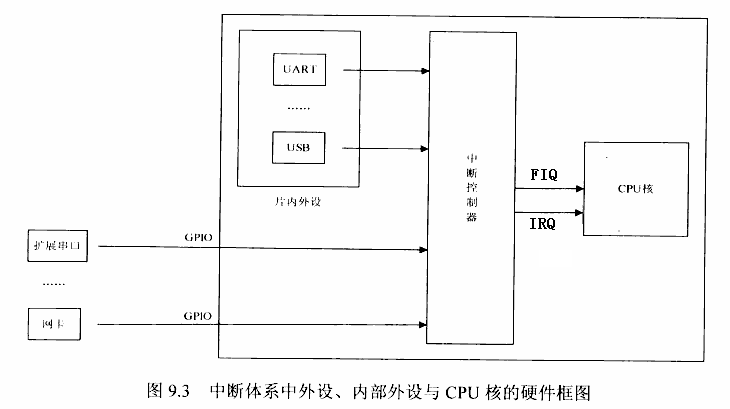
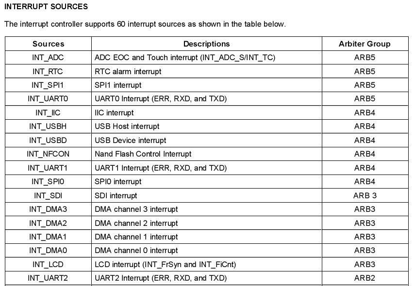
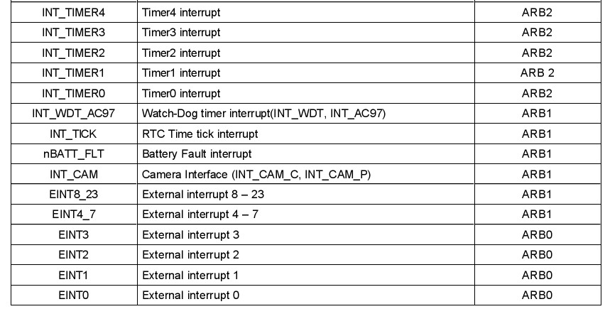
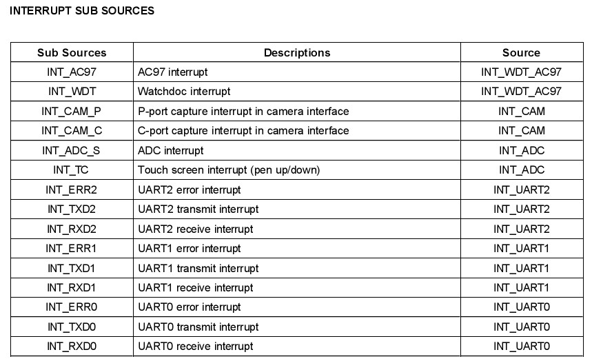
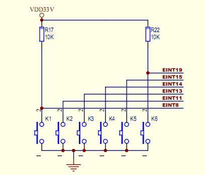
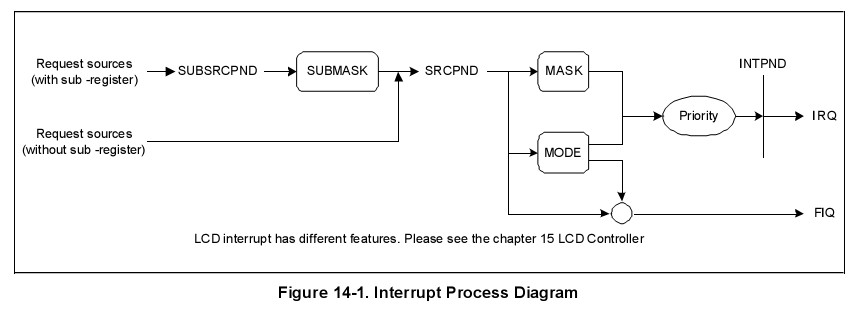
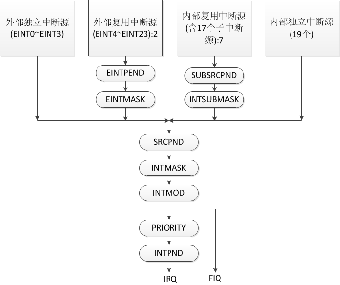

[ARM920T中断控制系统](http://blog.csdn.net/jinzheng_2010/article/details/6552029)

#中断控制机制
----
CPU运行过程中，如何知道各类外设发生了某些不预期的事件，比如串口收到了数据、按键被按下？
此时ARM有两种中断机制：

1.查询方式。程序不断地查询各设备的状态，并作出相应的反应。该方式实现比较简单，常用在比较单一的系统中，比如一个温控系统中可以使用查询方式不断检测温度的变化。特点：实现简单；但CPU利用率很低，不适合多任务的系统。

2.中断方式。当事件发生时，硬件会设置某个寄存器；CPU在执行完一个指令时，查看这个寄存器，如果所关注的事件发生了，则中断当前程序，跳转到一个固定的地址处理这个事件，处理完后返回到被终端的程序中继续运行。特点：实现相对复杂，但效率较高，是常用的方法。

#中断处理流程
----
1.中断控制器汇集各类外设发出的中断信号，然后通知CPU。  
2.CPU保存当前程序的运行环境，然后调用中断服务程序(ISR)来处理中断。  
3.在ISR中通过读取外设的相关寄存器来识别终端的类型，并进行相应的处理。  
4.清除中断。通过读写相关中断控制寄存器和外设相关寄存器来实现。  
5.恢复被中断程序的执行环境，继续执行被中断的程序。

#中断控制器，中断信号和中断源
----
ARM内核只有两个外部中断输入信号nFIQ和nIRQ。但对于一个系统来说，中断源可有多达几十个。S3C2440内部集成有一个中断控制器，该中断控制器有一共32路中断请求信号输入，在发生多路请求时执行仲裁动作，最终决定一路IRQ和一路FIQ送入CPU。

虽然中断控制器只有32路中断请求信号，但可以最多接受来自片内外设高达60个中断源（片内外设包括DMA控制器，UART控制器等等）的输入，这是因为对于部分中断源复用了一路中断请求信号通道。在32路通道中，有23路唯一对应一个中断源，其余9路通道（标红色）是复用的。  

以实时时钟中断为例，该控制器只会产生一种中断，它是单一中断源，直接将其中断信号线连接到中断控制器的REQ3/INT_RTC上。

对于复用中断源，以UART串口为例进行说明，S3C2440A可以支持3个UART串口，每个串口对应一个复合中断请求信号通道，以UART0为例，中断控制器上有一路输入REQ1/INT_UART0，UART0串口可以产生三种中断源，也就是三个子中断源：接收数据中断INT_RXD0，发送数据中断INT_TXD0，数据错误中断INT_ERR0，这三个子中断源在INT_UART0复合为一个中断源输入，三种子中断源中任何一个产生都会将中断信号传递给对应的中断源INT_UART0，然后通过中断控制器仲裁后传递给ARM内核。

##源和子源的列表：

 

##外部中断源和内部中断源
中断信号除上述分法之外，还可以按照硬件位置分为：外部中断源和内部中断源。

- **内部中断源**：它是S3C2440片内控制器产生的中断信号，比如：UART串口中断源，时钟Timer中断源，看门狗中断源等，这些都是嵌入式系统中常见硬件，所以S3C2440内部直接集成了这些常见硬件的控制器。
- **外部中断源**：有些设备并不是一个通用嵌入式系统里必备硬件，比如：蓝牙模块，各种传感器，WIFI无线通信模块，S3C2440片上没有集成这些硬件的控制器，而是作为外设挂载在S3C2440引出的外部引脚上（输入输出接口I/O Ports），连接到片内的中断控制器上，这些外部设备产生的中断叫做外部中断信号。外部设备的中断信号与SOC的连接方式与中断处理完全由系统硬件与软件设计者自己定义和实现。

按键Key可以认为最为简单的一种硬件设备了，如下图所示：

它功能很简单，可以将电路接通，按键K1~K6一端接地为低电平，另外一端接电源正极为高电平，EINT8，EINT11，EINT13，EINT14，EINT15，EINT19六根中断信号线分别和高电平端按键相连，当按键按下时电路接通，整个电路变成低电平，中断信号线上电压产生变化，通过设置中断触发方式，产生外部中断请求，输入到CPU内部，从而实现按键中断控制。

S3C2440A可以支持EINT0~EINT23共24种外部中断，完全可以满足小型嵌入式设备外设硬件的需求。
外部中断源也分为外部中断源和外部子中断源，其处理方式和内部中断源基本一样。

#中断处理流程图及相关寄存器
----
  

一个更清晰的流程处理图：
 
第一步：**SRCPND**标记着32路信号的发生状态，注意是32路信号，不是60个中断源的发生状态。中断源是如何被映射到信号山去的呢？

- 对于独立中断源，不需要经过特别处理过程，所以如果发生，直接反映在SRCPND的对应位上。
- 而对于复用的中断源，一旦发生首先记录发生状态在EINTPND/SUBSRCPND，然后CPU根据对应掩码EINTMASK/INTSUBMASK的设置将允许服务的中断源映射到SRCPND的对应位上    

第二步：根据**INTMASK** 对32路信号的掩码设置可以屏蔽**SRCPND**中的某些路信号。  

第三步：**INTMOD**是对32路信号的模式设置，即认为标记哪些信号通路是IRQ，哪些是FIQ。（注：最多只能设置一路FIQ）。根据INTMOD的设置，
  
- 如果某路信号被标记为IRQ并且未被**INTMASK**屏蔽，则进入仲裁阶段，转第四步。
- 如果某路是FIQ并且发生了则直接通知系统。

第四步：根据**PRIORITY**寄存器的设置对同时发生的IRQ进行优先级仲裁，即如果多路IRQ发生则最终CPU只会挑出一路IRQ通知给系统，经过中断优先级仲裁器选出优先级最高的IRQ中断后，这个中断在**INTPND**寄存器中的相应位被置1，如前所述，CPU在执行完每条指令后可以检查该寄存器，如果上面有IRQ发生，则进入IRQ中断模式处理它。同一时间内，此寄存器只有一位被置1，在ISR中可以根据这个位确定中断类型。清除该中断时，往这个位写入0。 

##相关寄存器汇总
- SRCPND：标识32路中断信号输入上哪些中断发生了。在IRQ中断服务程序中需要清理；在FIQ中断服务程序中也需要清理。
- INTMASK：屏蔽SRCPND，如果一个中断的屏蔽位为1，在该中断发出请求时挂起位还是会被设置为1，但中断请求都不被受理。
- INTMOD：设置哪些中断请求信号为FIQ，哪些为IRQ，但只有一个中断信号输入可以被设置为FIQ模式。
- PRIORITY：配置IRQ的优先级
- INTPND：标识32路中断信号经过屏蔽过滤和仲裁，最后剩下的FIQ和IRQ。在IRQ中断服务程序中需要清理，但在FIQ中断服务程序中不需要清理INTPND。
- INTOFFSET:用于检测INTPND中有关IRQ的发生和过滤情况，FIQ的信息不用该寄存器检测。
- EXTINT0~EXTINT2:24个外部中断分为三组，用这三个寄存器分别用于配置外部中断的触发方式(高电平，低电平，上升沿，下降沿，上升下降均可)。

#优先级仲裁
----
S3C2440A支持60种中断，多个硬件可能同时产生中断请求，由于CPU只能处理一个中断，中断控制器怎么选择出一个最佳的中断，交给ARM内核进行处理呢？ 中断控制器采用优先级仲裁比较的方式进行选择，找出优先级最高的中断源。中断控制器将60种中断源分成7组，如下图所示，它类似体育赛事里的比赛方式，所有参赛选手在小组赛PK，选择出小组赛最优秀选手，然后进入决赛阶段和其它小组最优先选择再PK，最后优胜者就是总冠军。其中ARBITER0~ARBITER5为“小组赛”阶段，中断源信号在各自小组里进行优先级仲裁，选择出最高优先级中断信号，每小组选出的中断信号送到ARBITER6，也就是决赛阶段，选择出最高优先级中断信号，交给ARM内核。

 
     