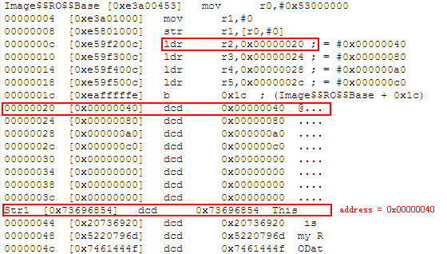
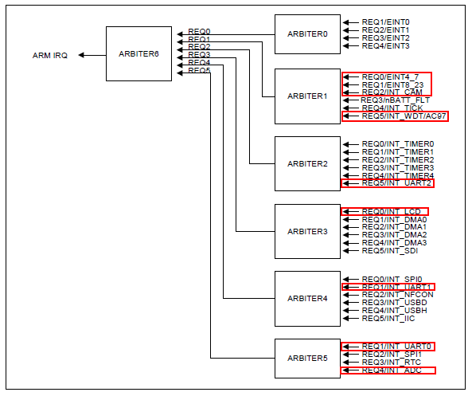

ex2-1
----
ldr的伪操作的理解  
0000000c行指令将地址0x00000020处的一个字load到r2,该值就是str标号的地址值0x00000040
0x00000020是所有代码之后，满足书上P35所述“在没有指定数据缓冲池的情况下，默认从从所有指令代码之后开始”。  
  
根据对齐的要求，str1从第65个字节处开始。  
Init_DATA.s中的“BEQ %F2”, "%F2"是对局部标号的引用形式，[参考](http://www.cnblogs.com/hoys/archive/2010/12/01/1892578.html)  

ex2-2
----
	AREA  led_Bram,CODE,READONLY	;定义一个代码段，名为led_Bram0
	ENTRY							;指定汇编程序的入口点
		LDR		R0,=0x53000000		;关闭看门狗
		LDR		R1,=0x0
		STR		R1,[R0]
		LDR		R0,=0x56000010		;R0设为GPBCON寄存器地址
		LDR     R1,=0x15400			;00000000000000010101010000000000
									;GPB5 [11:10] 01(Output) -> LED1
									;GPB6 [13:12] 01(Output) -> LED2
									;GPB7 [15:14] 01(Output) -> LED3
									;GPB8 [17:16] 01(Output) -> LED4
									;将第10位到第16位设置为Output
		STR		R1,[R0]
		LDR		R0,=0x56000018		;R0设为GPBUP寄存器地址
		LDR     R1,=0x1e0			;111100000 第5位到第8位设置为1，disabled
		STR    	R1,[R0]             ;设置GPBUP，对LED1和LED4对应的电阻禁止上拉，
									;禁止的目的是要让后继的GPBDAT控制起作用。
									;(If the port pull-up register is enabled
									;then the pull-up resisters work without
									;pin’s functional setting).
		LDR		R3,=0x56000014		;R3设为GPBDAT寄存器地址
	MAIN_LOOP
		LDR     	R4,=0x00		;R4为输出内容，先灭等
		STR     	R4,[R3]			;GPBDAT输出00，LEDn为低电平，电流产生，灯亮
		LDR     	R4,=0x1e0		;R4为输出内容，第5位到第8位设置为1
		STR     	R4,[R3]			;GPBDAT输出f0，LED熄灭
		B       	MAIN_LOOP		;死循环
	END								;汇编程序结束标识。

ex2-5  
----
参考：  
http://blog.csdn.net/mybelief321/article/details/8914299 - 这个
http://blog.csdn.net/vanson18/article/details/6780674 - 这个有一些基本概念的介绍

	;MDIV=92, PDIV=1, SDIV=1, so according to fomula @7-20 S3C2440
	;manual,FCLK=400MHz
	;咱们经常用的就是FCLK=400MHz和FCLK=200MHz
	;for 400Mhz, MDIV=92, PDIV=1, SDIV=1
	;for 200Mhz, MDIV=92, PDIV=4, SDIV=1
    MPLL	EQU	((0x5c<<12)|(0x01<<4)|(0x01))
	
	;分频比
	;当CLKDIV_VAL=0 时，FCLK：HCLK：PCLK=1：1：1
	;当CLKDIV_VAL=1 时，FCLK：HCLK：PCLK=1：1：2
	;当CLKDIV_VAL=2 时，FCLK：HCLK：PCLK=1：2：2
	;当CLKDIV_VAL=3 时，FCLK：HCLK：PCLK=1：2：4
	;当CLKDIV_VAL=4 时，FCLK：HCLK：PCLK=1：4：4
	;当CLKDIV_VAL=5 时，FCLK：HCLK：PCLK=1：4：8
	;当CLKDIV_VAL=6 时，FCLK：HCLK：PCLK=1：3：3
	;当CLKDIV_VAL=7 时，FCLK：HCLK：PCLK=1：3：6	
	SCALE	EQU	((0x0<<3)|(0x2<<1)|(0x01))		;FCLK:HCLK:PCLK = 1:4:8

	GET	2440Reg_addr.inc

	AREA  MyCode,CODE,READONLY	;定义一个代码段，名为MyCode
	ENTRY						;指定汇编程序的入口点

		LDR		R0,= WTCON		;关闭看门狗
		LDR		R1,=0x0
		STR		R1,[R0]

		;开始设置时钟
		;第1步：设置分频比
		LDR		R0,=CLKDIVN
		LDR		R1,=SCALE			
		STR		R1,[R0]

		;第2步，对分频后的补充设置，参考S3C2440 UM Page7-9
		;当HDIVN==0的时候,FCLK:HCLK:PCLK=1：1：1,此时CPU的主频和快速总线时钟频率
		;一致，此时总线模式为“快速总线模式”。如果不是这个比例，或者说HDIVN!=0的时候，
		;这个时候我们总线上的频率和CPU的频率就不一样了，所以我们要把总线模式改为异步
		;总线模式。（S3C2440不支持同步总线模式）
		;MRC和MCR是协处理器相关命令
		MRC    	p15, 0, R1, c1, c0, 0	;读出控制寄存器
		ORR    	R1, R1, #0xC0000000		;设置asynchronous bus mode
    	MCR    	p15, 0, R1, c1, c0, 0	;写入控制寄存器

		;第3步，设置主频FCLK
		LDR		R0,=MPLLCON
		LDR		R1,=MPLL			;设置FCLK
		STR		R1,[R0]
		GET		Led_Flicker.s

		;第4步，软件工作：等待locktime时间，让新的Fclk生效
		;根据PAES Page47，该操作可选
	END								;汇编程序结束标识。

ex2-7 
----
SDRAM  
参考[唐攀的blog](http://blog.csdn.net/mr_raptor/article/details/6555786)  
有个地方自己解释一下：关于为何SDRAM的地址是A0~A12，最大寻址8M。实际上一片SDRAM（就mini2440的情况）是32MB。它是由16b * 4M * 4bank,即由四组bank组成，每组bank包含4M个单元，每个单元有16bit，即2个字节。所以总容量为(2B * 4M) * 4bank;前面为8M个字节，可以用A0~A12寻址，另外的bank号用BA0和BA1来标识。所以一片内存容量为32MB  

两片SDRAM并联，共享地址线(ADDR2~ADDR14[A0~A12],ADDR24[BA0],ADDR25[BA1])。CPU通过GCS片选区分这两片SDRAM。  

		LDR 	R0,=SMRDATA		;SMRDATA数据开始地址
		LDR 	R1,=BWSCON    	;BWSCON地址
		ADD    	R2, R0, #52   	;SMRDATA数据结束地址,52是13个DCD的总长度
	0	;通过循环SMRDATA的表数据初始化SDRAM
		LDR 	R3, [R0], #4	;读出数据
		STR    	R3, [R1], #4	;写入寄存器
		CMP    	R2, R0 			;判断是否结束
		BNE    	%B0				;逆向返回标号0
		MOV		PC,LR			;初始化SDRAM返回
	SMRDATA
		;对BWSCON，只对Bank7和Bank6有设置为"0010"，其他都缺省值,参考唐攀的解释
    	DCD 	0x22000000		;BWSCON
		DCD    	0x00000700     	;BANKCON0
    	DCD    	0x00000700     	;BANKCON1
     	DCD    	0x00000700     	;BANKCON2
     	DCD    	0x00000700     	;BANKCON3  
    	DCD    	0x00000700     	;BANKCON4
    	DCD    	0x00000700     	;BANKCON5
    	DCD    	0x00018005      ;BANKCON6
    	DCD    	0x00018005     	;BANKCON7
    	DCD    	0x008c04f3      ;REFRESH
    	DCD    	0x000000b1      ;BANKSIZE
    	DCD    	0x00000030     	;MRSRB6
    	DCD   	0x00000030     	;MRSRB7
	END						;包含文件内的汇编结束伪指令

ex2-17
----
中断  
中断信号和中断源
---
S3C2440可以最多接受来自60个中断源，但同时最多只能有32路输入信号，这是因为有部分中断源是复用的。在32路输入信号中，有23路唯一对应一个中断源，其余9路信号（标红色）是复用的。
  
中断处理流程图及相关寄存器
---   
- SRCPND标记着32路信号的发生状态，注意是32路信号，不是60个中断源的发生状态。中断源是如何被映射到信号山去的呢？对于独立中断源，不需要经过特别处理过程，所以如果发生，直接反映在SRCPND的对应位上。而对于复用的中断源，一旦发生首先记录发生状态在EINTPND/SUBSRCPND，然后CPU根据对应掩码EINTMASK/INTSUBMASK的设置将允许服务的中断源映射到SRCPND的对应位上    
- 所以INTMASK可以认为是对32路信号的掩码设置。  
- INTMOD是对32路信号的模式设置，即认为标记哪些信号通路是IRQ，哪些是FIQ。注：最多只能设置一路FIQ。  
- 如果某路信号被标记为IRQ并且发生了则需要根据PRIORITY寄存器的设置进行优先级仲裁，即如果多路IRQ发生则最终CPU只会挑出一路IRQ通知给系统，而如果某路是FIQ并且发生了则直接通知系统。  
- 相关寄存器的清理：
 + 在IRQ中断服务程序中需要清理的寄存器包括SRCPND和INTPND的对应位。
 + 在FIQ中断服务程序中不需要清理INTPND，但需要清理SRCPND。
- INTOFFSET
- EXTINT0~EXTINT2:24个外部中断分为三组，用这三个寄存器分别用于配置外部中断的触发方式(高电平，低电平，上升沿，下降沿，上升下降均可)。  
      

		Mode_USR	EQU     0x50	;IRQ中断开放，FIQ中断关闭
		Mode_FIQ 	EQU     0xD1	;关闭IRQ、FIQ中断
		Mode_IRQ	EQU     0xD2	;关闭IRQ、FIQ中断
		Mode_SVC 	EQU     0xD3	;关闭IRQ、FIQ中断
		Mode_ABT	EQU     0xD7	;关闭IRQ、FIQ中断
		Mode_UND	EQU     0xDB	;关闭IRQ、FIQ中断
		Mode_SYS	EQU     0xDF	;关闭IRQ、FIQ中断

		GET	2440Reg_addr.inc
		AREA    MyCode, CODE,READONLY
		ENTRY
			;----------------------------设置中断向量表
			B	ResetHandler		;for Reset
			B	. 					;handlerUndef
			B	. 					;SWI interrupt handler
			B	. 					;handlerPAbort
			B	. 					;handlerDAbort
			B	. 					;handlerReserved
			B	HandlerIRQ			;HandlerIRQ
			B	.					;HandlerIRQ
	
		ResetHandler 					
			BL	Clock_Init			;初始化看门狗、时钟

			BL	MemSetup			;初始化SDRAM

			;----------------------- 设置堆栈，注：这个工作建议在main_loop之前再做，确保在异常向量表全部初始化完了之后在打开中断
	 		LDR	SP, =SvcStackSpace	;设置管理模式堆栈 
        	MSR	CPSR_c, #Mode_IRQ
			LDR	SP, =IrqStackSpace	;设置IRQ中断模式堆栈
			MSR	CPSR_c, #Mode_FIQ
			LDR	SP, =FiqStackSpace	;设置FIQ中断模式堆栈 
			MSR	CPSR_c, #Mode_ABT
			LDR	SP, =AbtStackSpace	;设置预取终止模式堆栈 
			MSR	CPSR_c, #Mode_UND
			LDR	SP, =UndtStackSpace	;设置未定义模式堆栈 
			MSR	CPSR_c, #Mode_USR
			LDR	SP, =UsrStackSpace	;设置用户与系统模式堆栈并进入用户模式,注意此时会打开中断

			BL	Init_DATA			;初始化可读写数据

			;----------------------- 初始化GPG5、GPG6、GPG7、GPG11为外部中断
			LDR	R0,=GPGCON			;R0设为GPGCON寄存器地址
			;set GPG5/GPG6/GPG7/GPG11 to work as 
			;EINT13/EINT14/EINT15/EINT19, the sample demo FOUR keys
			;0x0080A800 = 0b100000001010100000000000
			LDR	R1,=0x0080A800		;R1为控制字内容
			STR	R1,[R0]
		
			;----------------------- mask unused interrupts
			;0x00F71FFF = 0b111101110001111111111111
			;enable EINT13/EINT14/EINT15/EINT19
			;EINT4~EINT23 maps to bit[4:23], last 4 bits are reserved 
			;just for convenience 
			LDR	R0,=EINTMASK
			LDR	R1,=0x00F71FFF		;R1为控制字内容
			STR	R1,[R0]				;开放EINT13、14、15、19中断
		
			;----------------------- configure interrupt trigger method
			LDR	R0,=EXTINT1			; for EINT13, EINT14 and EINT15
			LDR	R1,=0x0				; disable filter, low level triggered
			STR	R1,[R0]				; 均为低电平中断，不使用滤波
			LDR	R0,=EXTINT2			; for EINT19
			LDR	R1,=0x0				; R1为控制字内容
			STR	R1,[R0]				; 均为低电平中断，不使用滤波
		
			;----------------------- configre interrupt entry 
			LDR	R0,=INTMSK
			;0xFFFFFFDF = 0b11111111111111111111111111011111
			LDR	R1,=0xFFFFFFDF		;R1为控制字内容
			STR	R1,[R0]				;开放EINT8_23中断
		
			;----------------------- write handler address for EINT8_23
			;interrupt entry dispatch table is defined in
			;Int_EntryTable.s, and 'pEINT8_23' is one of
			;32 entries. evey entry is predefined as a WORD
			;and here just fill the address of the handler for
			;EINT8_23.
			LDR	R0,=pEINT8_23		;R0设为中断入口散转表中对应地址
			LDR	R1,=EINT8_23		;R1中断服务程序入口地址
			STR	R1,[R0]				;中断服务程序入口地址写入中断散转表
		
			;----------------------- 设置LED的控制寄存器
			LDR	R0,=GPBCON			;R0设为GPBCON寄存器地址
			LDR	R1,=0x15400			;R1为控制字内容
			STR	R1,[R0] 			;设置GPB高4位为输出口
			LDR	R2,=GPBUP			;R2设为GPBUP寄存器地址
			LDR	R3,=0x1E0			;R3为输出内容
			STR	R3,[R2]            	;GPBDAT高4位禁止上拉
			LDR	R4,=GPBDAT			;R4设为GPBDAT寄存器地址
			LDR	R5,=0x00			;R5为输出内容 - 将4个LED初始化为点亮
			;Reset异常不会返回，所以这里Reset执行完毕后接着执行MAIN_LOOP
			
		MAIN_LOOP
			STR	R5,[R4]				;GPBDAT输出00，将4个LED初始化为点亮
			B	MAIN_LOOP			;死循环

		Clock_Init
			GET	Clock_Init.s		;初始化看门狗、时钟
		
		MemSetup		
			GET	MemSetup.s			;初始化SDRAM
		
		Init_DATA
			GET	Init_DATA.s			;初始化可读写数据区			

		HandlerIRQ
			SUB		LR, LR, #4		;计算返回地址后存入LR
    		STMFD	SP!, {LR}		;将LR的内容入栈保存，此时的sp是中断模式的sp
			
			LDR		LR, =Int_Return	;存放了EINT8_23函数的返回地址，原理是EINT8_23最后会
									;调用MOV PC,LR指令返回，所以返回到Int_Return处
									;然后执行HandlerIRQ的返回逻辑
			
			LDR		R0, =INTOFFSET	;R0设为INTOFFSET寄存器地址
			LDR		R1, [R0]
			LDR		R2, =Int_EntryTable
			LDR		PC, [R2,R1,LSL#2]	;将转入的服务程序看成是一个普通的无参子程序
										;[R2,R1,LSL#2]的作用：
										;R2是Int_EntryTable表的基址
										;R1中存放INTOFFSET里记录的中断向量的偏移量
										;然后查Int_EntryTable的表得到处理函数EINT8_23的地址
										;直接修改PC即跳转到EINT8_23执行处理函数

		Int_Return						;这个无参子程序以MOV PC,LR指令返回
			LDMFD	SP!, {PC}^			;中断服务程序HandlerIRQ返回，^表示将spsr的值复制到cpsr
	
		EINT8_23						;这个函数可以看成是HandlerIRQ里调用的子程序
			LDR		R0,=EINTPEND		;R0设为EINTPEND寄存器地址
			LDR 	R1,[R0]
			CMP     R1,#0x008000	
			LDREQ   R5,=0x1C0			;R5为输出内容
			CMP     R1,#0x004000	
			LDREQ   R5,=0x1A0			;R5为输出内容
			CMP     R1,#0x080000	
			LDREQ   R5,=0x160			;R5为输出内容
			CMP     R1,#0x002000	
			LDREQ   R5,=0x0E0			;R5为输出内容

			LDR		R0,=SRCPND			;R0设为SRCPND寄存器地址
			LDR 	R1,[R0]
			STR		R1,[R0]				;先清除SRCPND中断标志
			LDR		R0,=INTPND			;R0设为INTPND寄存器地址
			LDR 	R1,[R0]
			STR		R1,[R0]				;再清除INTPND中断标志
			LDR		R0,=EINTPEND		;R0设为EINTPEND寄存器地址
			LDR 	R1,[R0]
			STR		R1,[R0]				;再清除EINTPEND中断标志
			MOV		PC,LR				;服务程序返回
			
		AREA    MyRWData, DATA, READWRITE	;设置RW Base=0x33ffe700

		Int_EntryTable
			GET		Int_EntryTable.s			;中断入口散转表，共32个入口
        
		AREA    MyZIData, DATA, READWRITE, NOINIT	,ALIGN=8
		;下推式堆栈，根据对齐方式，段起始地址为0x33ffe800，各栈区空间均为1k

						SPACE	0x100 * 4  		;管理模式堆栈空间
		SvcStackSpace	SPACE	0x100 * 4  		;中断模式堆栈空间
		IrqStackSpace	SPACE	0x100 * 4  		;快速中断模式堆栈空间
		FiqStackSpace	SPACE	0x100 * 4  		;终止模式堆栈空间
		AbtStackSpace	SPACE	0x100 * 4 		;未定义模式堆栈空间
		UndtStackSpace	SPACE	0x100 * 4 		;用户（系统）模式堆栈空间
		UsrStackSpace
		END 
